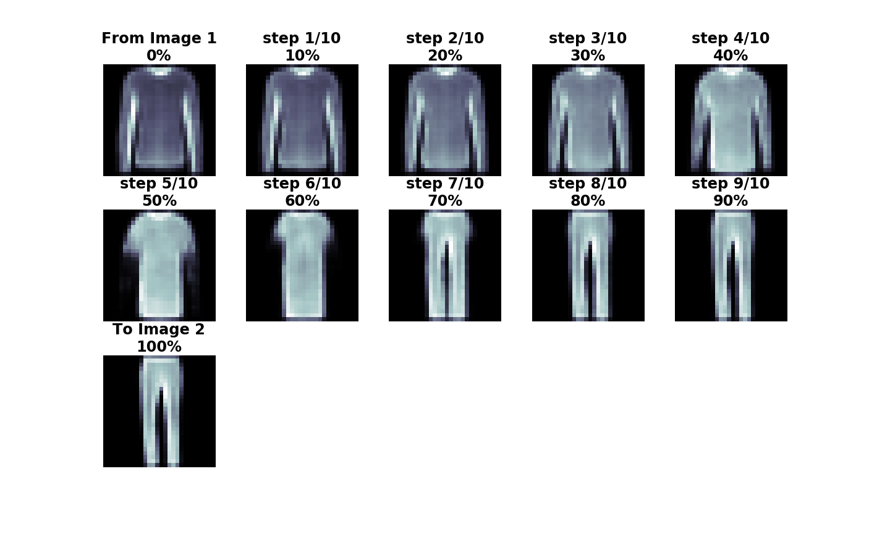

# letter_digit_generator_VAE
This project aims to build a conditional variational autoencoder (CVAE) to generate arbitrary handwritten letters/digits based on the keyboard input. Based on the [EMNIST dataset](https://www.nist.gov/node/1298471/emnist-dataset), the CVAE model is trained to encode the handwritten letters/digits into a latent vector space. With a random sampling or interpolation technique, imaginary letters and digits are generated.

### EMNIST data examples

## LDG Version 3
* Loss: binary crossentropy
* Optimizer: Adam
* Latent dimension: 6
* Image normalization: [0, 1]
* Last activation function of the decoder: sigmoid
* Convolutional CVAE layers: [784,62]-[784]-[(28,28,1)]-[(14,14,16)]-[(7,7,32)]-[1568]-[64]-[6] // [6,62]-[64]-[1568]-[(7,7,32)]-[(14,14,32)]-[(28,28,16)]-[(28,28,1)]-[784]
* Multi-layer CVAE layers: [784,62]-[256]-[128]-[6] // [6,62]-[128]-[256]-[784]  

### [ldg_v3_gen](https://github.com/sungsujaing/Artificial_Intelligence_Data_Science_Portfolio/blob/master/Letter_digit_generator/ldg_v3_gen.py)
A command-line letters/digits generator based on the ldg_v3 Conv-CVAE model (details below). It simply loads the Conv-CVAE model and the corresponding best weights to produce results.

### [letter_digit_generator_convolutional-CVAE](https://github.com/sungsujaing/letter_digit_generator_VAE/blob/master/letter_digit_generator_v3_conv-CVAE.ipynb) and [letter_digit_generator_multi-layer-CVAE](https://github.com/sungsujaing/letter_digit_generator_VAE/blob/master/letter_digit_generator_v3_CVAE.ipynb)
* label inputs to both encoder and decoder
### Training

### Dataset reconstruction 

### Generating new letters/digits (with/without arbitrary binary threshold filter)

## LDG Version 2
* Loss: MSE
* Optimizer: Adam
* Latent dimension: 10
* Image normalization: [-1, 1]
* Last activation function of the decoder: tanh
* Convolutional CVAE layers: [784,62]-[784]-[(28,28,1)]-[(28,28,16)]-[(28,28,32)]-[(28,28,64)]-[12544]-[128]-[10] // [10,62]-[128]-[12544]-[(14,14,64)]-[(28,28,32)]-[(28,28,16)]-[(28,28,1)]-[784]
* Multi-layer CVAE layers: [784,62]-[512]-[256]-[10] // [10,62]-[256]-[512]-[784]  

### [ldg_v2_gen](https://github.com/sungsujaing/Artificial_Intelligence_Data_Science_Portfolio/blob/master/Letter_digit_generator/ldg_v2_gen.py)
A command-line letters/digits generator based on ldg_v2 Conv-CVAE model (details below). It simply loads the Conv-CVAE model and the corresponding best weights to produce results.

### [letter_digit_generator_convolutional-CVAE](https://github.com/sungsujaing/letter_digit_generator_VAE/blob/master/letter_digit_generator_v2_conv-CVAE.ipynb) and [letter_digit_generator_multi-layer-CVAE](https://github.com/sungsujaing/letter_digit_generator_VAE/blob/master/letter_digit_generator_v2_CVAE.ipynb)
* label inputs to both encoder and decoder
### Training (direct comparison is difficult due to the difference in epochs)

### Dataset reconstruction 

### Generating new letters/digits (with/without arbitrary binary threshold filter)

## LDG Version 1
### [letter_digit_generator_convolutional-CVAE](https://github.com/sungsujaing/letter_digit_generator_VAE/blob/master/letter_digit_generator_v1.ipynb)
Initial convolutional conditional variational autoencoder model.
* label inputs only to decoder
* training/test data reconstructions were satisfactory, but generation of specific string input was somewhat difficult.

---

### [(ARCHIVE) convolutional VAE: initial model building and function testings on F_MNIST](https://github.com/sungsujaing/letter_digit_generator_VAE/blob/master/convolutional%20beta-VAE%20on%20F_MNIST.ipynb)
#### VAE interpolation from image 1 to image 2

### [(ARCHIVE) Dog_crossbreed_prediction](https://github.com/sungsujaing/letter_digit_generator_VAE/tree/master/(archive)vae_test_standford_dog_breed_dataset/dog_crossbreed_prediction)
While the model architecture seems to be okay, the [standford dogs datasets](http://vision.stanford.edu/aditya86/ImageNetDogs/) may not be suitable to train VAE.
